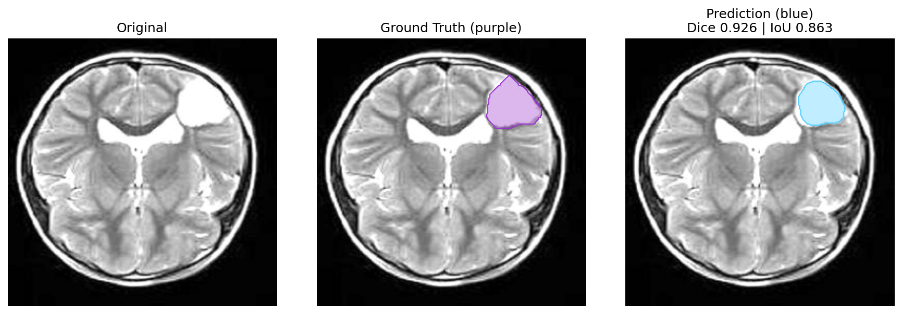
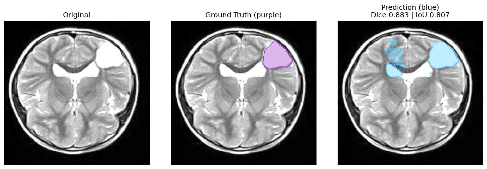
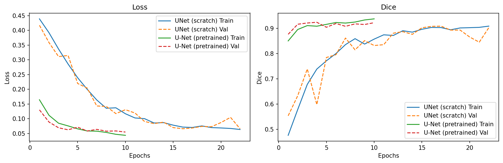

# MRI Brain Tumor Segmentation (U-Net: Scratch vs. Pretrained)

This repository contains an end-to-end pipeline for 1-channel MRI brain tumor segmentation. The workflow covers dataset inspection, reproducible 80/10/10 splits, mask generation from VIA annotations, training with a custom U-Net and a ResNet-34 pretrained U-Net and evaluation via Dice/IoU with qualitative overlays.

## Jupyter Notebook

All steps are documented and visualized:

→ Open: [`brain_tumor_segmentation.ipynb`](./brain_tumor_segmentation.ipynb)

## Pipeline Overview

- Dataset split to 80/10/10 (train/val/test) with size-aware stratification (small/medium/large tumors).
- Mask generation from VIA annotations. Images and masks are kept in sync.
- Augmentation for MRI (flip, shift/scale/rotate, contrast, noise, elastic/grid distortions).
- Two models with identical loaders/losses:
  - Scratch U-Net (1-channel).
  - Pretrained U-Net (ResNet-34 encoder via `segmentation_models_pytorch`, initialized from ImageNet).
- Loss: Focal + Dice, metrics: Dice and IoU.
- Checkpoints and training curves saved for reproducibility. Qualitative overlays exported to `reports/`.

## Requirements

- Python 3.8+
- PyTorch
- segmentation-models-pytorch
- albumentations
- opencv-python
- numpy
- matplotlib
- Pillow
- scikit-learn
- tqdm

## Results

The scratch U-Net converged more steadily and generalized better than the pretrained variant.

- **Scratch U-Net:** Dice ≈ 0.874, IoU ≈ 0.814  
- **Pretrained (ResNet-34 via SMP):** Dice ≈ 0.855, IoU ≈ 0.795

Overlay visualizations are saved under `reports/unet_base/` and `reports/smp_finetune/`.

### Example Predictions

| Scratch U-Net | Pretrained (SMP ResNet-34) |
|---|---|
|  |  |

> Ground truth (purple) vs. prediction (blue). More examples are shown in the notebook.

### Training Curves

## License

This project is distributed under the **MIT License**.  
See the [LICENSE](LICENSE) file for the full text.

© 2025 Saniye Ogul.

